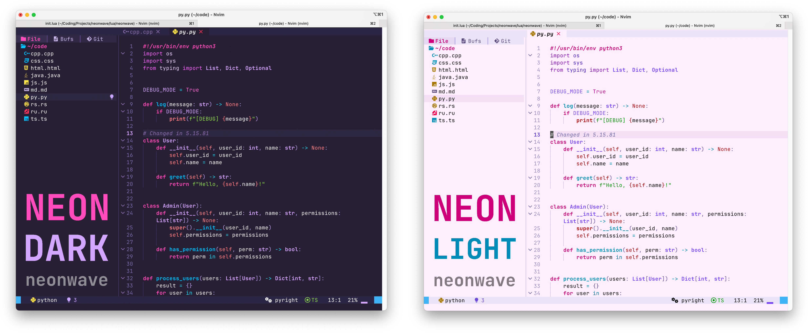
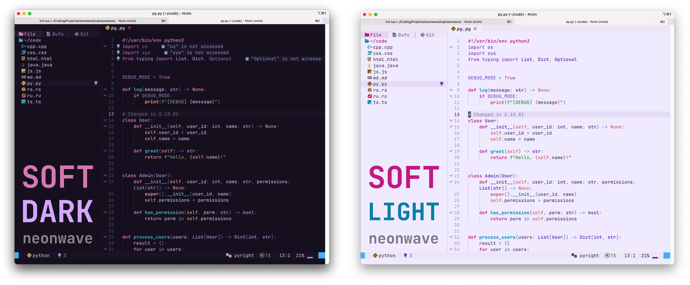
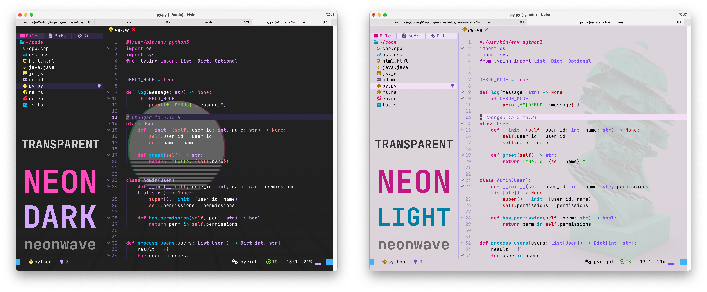

# 🔮 neonwave.nvim

A **Neovim** colorscheme modelled after vaporwave aesthetics 📼. Characterised by bright contrasting neon colours 🌆

Implemented with **[lush.nvim](https://github.com/rktjmp/lush.nvim)**

Give it a try! Leave a star if you find it amusing ⭐️

---

## Demo





---

## Features

### Styles
**Two intensities**: 
- **`neon`** : Default. Bright, punchy, contrasting colours.
- **`soft`** : Same feel, softer colours. 

**Light/Dark** 
- **`light`** : Light mode with a pink tint.
- **`dark`** : Dark mode with a purple tint.

**Transparent Background** 
- **`false`** : Default. Solid background.
- **`true`** : Neovim will use your terminal background.

### Supported Plugins
Optimised for my personal Neovim config, [AstroNvim](https://github.com/astronvim/astronvim)
- **Treesitter** highlights
- **LSP diagnostics**, core UI (status line, tabs, floats, search) 
- **Neo-tree** (including source tabs)
- **`snacks.nvim` picker** highlights tuned for readability on both backgrounds.

PS, feel free to add your own with a pull request.

---

## Requirements

- **Neovim** 0.8+ (0.9+ recommended for Treesitter `@` captures)
- [`termguicolors`](https://neovim.io/doc/user/options.html#'termguicolors')
- **[lush.nvim](https://github.com/rktjmp/lush.nvim)** - required dependency (colors are applied via Lush).

---

## Installation

Install from GitHub with your plugin manager.  

Always call **`require("neonwave").setup({ … })` before `colorscheme neonwave`** so intensity and background apply when `colors/neonwave.lua` runs.

### lazy.nvim

```lua
{
  "miladggg/neonwave.nvim",
  lazy = false,
  priority = 1000,
  dependencies = { "rktjmp/lush.nvim" },
  config = function()
    require("neonwave").setup({
      intensity = "neon",
      background = "dark",
      transparent_background = false,
    })
    vim.cmd.colorscheme("neonwave")
  end,
}
```

Use **`lazy = false`** (or otherwise ensure this plugin loads before the first `:colorscheme`) so `setup()` runs before `colors/neonwave.lua`.

### packer.nvim

```lua
require("packer").startup(function(use)
  use({ "rktjmp/lush.nvim" })
  use({
    "miladggg/neonwave.nvim",
    requires = { "rktjmp/lush.nvim" },
    config = function()
      require("neonwave").setup({
        intensity = "neon",
        background = "dark",
        transparent_background = false,
      })
      vim.cmd.colorscheme("neonwave")
    end,
  })
end)
```

### vim-plug

```vim
Plug 'rktjmp/lush.nvim'
Plug 'miladggg/neonwave.nvim'

lua << EOF
require("neonwave").setup({
  intensity = "neon",
  background = "dark",
  transparent_background = false,
})
vim.cmd.colorscheme("neonwave")
EOF
```

---

## Configuration

Pass options to **`require("neonwave").setup({ … })`**.

| Option | Type | Description |
|--------|------|-------------|
| `intensity` | `"soft"` \| `"neon"` | Brightness, contrast and colour saturation. |
| `background` | `"dark"` \| `"light"` | Light and Dark mode. |
| `transparent_background` | `boolean` | Allows terminal background image to be visible. |

### Examples

#### Neon Light:
```lua
require("neonwave").setup({
  intensity = "neon",
  background = "light",
})
vim.cmd.colorscheme("neonwave")
```

#### Soft Dark with a Transparent background:
```lua
require("neonwave").setup({
  intensity = "soft",
  background = "dark",
  transparent_background = true,
})
vim.cmd.colorscheme("neonwave")
```

---
## Setup
Complete installation and run:
```:colorscheme neonwave```

## Customizing colors

- All hex lives in **`lua/neonwave/palette.lua`**.
- **`lua/neonwave/theme.lua`** maps those tokens through Lush.

Feel free to go inside and change around the colours to your liking.

---


## Contributing

Issues and pull requests are welcome. See **[`CONTRIBUTING.md`](CONTRIBUTING.md)** for the contribution details.

---

## Acknowledgements

- **[lush.nvim](https://github.com/rktjmp/lush.nvim)** - colorscheme DSL and tooling.
